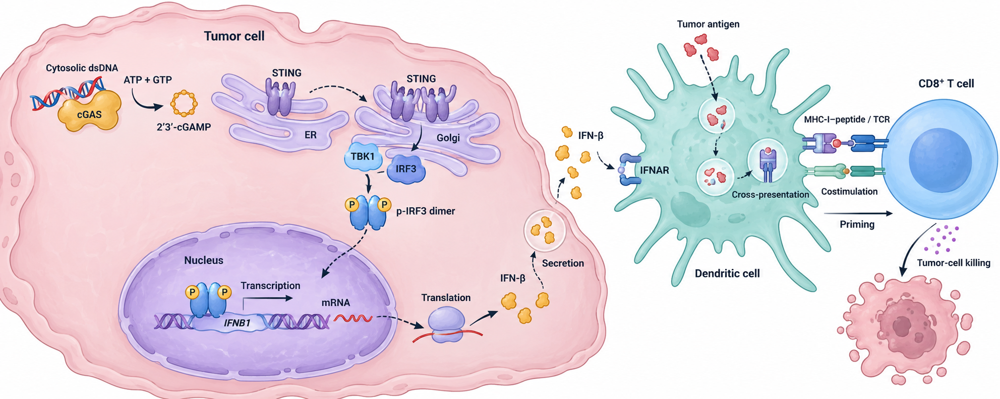
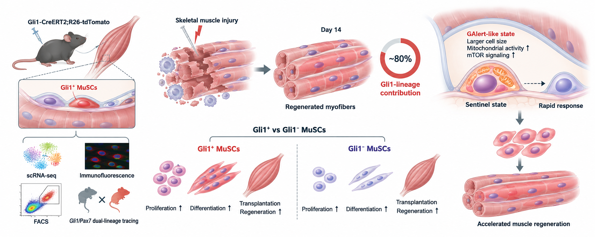

# Cell Image

**Scientific visualization infrastructure for AI agents.**<br>
Turn papers, abstracts, proposals, and research plans into **scientifically constrained, editable, reviewable, publication-aware figures**.

[](CHANGELOG.md)
[](LICENSE)
[](SKILL.md)
[](scripts)

Cell Image is an open-source Agent Skill that turns research content into scientifically constrained, publication-aware, editable figures. It ships reusable schemas, validators, journal profiles, SVG audits and evidence-aware workflows—so scientific visualization can be a dependable agent capability instead of a collection of one-off image prompts.

It first converts research content into a structured scientific argument, then selects an appropriate rendering route, and finally audits scientific relationships, visible text, SVG editability, and publication constraints.

> **Research content → structured visual argument → constrained rendering → editable artifact → automated QA**

## Examples

| cGAS–STING tumor immunity | Gli1⁺ muscle stem-cell regeneration |
|---|---|
|  |  |

These images demonstrate the intended visual quality and information hierarchy. For formal deliverables, Cell Image also requires a structured specification, an editable SVG, and QA records. The examples are not experimental data and should not be treated as submission-ready by default.

## Why Cell Image exists

General-purpose image models can produce attractive scientific illustrations quickly, but they often struggle with:

- turning associations into unsupported causal claims;
- inventing mechanisms or labels that are absent from the source;
- producing non-editable raster outputs that are difficult to audit;
- ignoring journal dimensions, typography, resolution, and AI artwork policies;
- presenting generated microscopy, pathology, Western blot, or imaging content as experimental evidence.

Cell Image treats a scientific figure as a verifiable **visual argument**, not merely an image. Its priority order is:

```text
Scientific facts > Explicit user requirements > Evidence boundaries
                 > Journal policies > Domain visual grammar
                 > Figure structure > Model adaptation > Aesthetics
```

## What the skill provides

- **Figure Contract** — defines the core conclusion, evidence roles, required entities, forbidden implications, and reviewer risks before rendering.
- **Evidence-aware relations** — distinguishes `DEMONSTRATED`, `SUPPORTED`, `ASSOCIATED`, `CONTEXT`, and `FORBIDDEN` claims.
- **Domain × Figure-Type routing** — loads only the rules needed for a domain, figure type, and purpose instead of relying on one oversized prompt.
- **Journal / AI Policy Gate** — treats visual style and submission requirements as separate concerns and clearly marks policies that have not been verified.
- **Exact Visible Text** — constrains labels with an explicit allowlist to reduce garbled or hallucinated text.
- **Editable delivery** — defaults to an authoritative SVG plus a PNG preview and detects raster-wrapped “fake SVGs.”
- **Fidelity reconstruction** — freezes an approved composition and uses an Anchor Map, Text Manifest, and coarse visual checks to control drift during SVG reconstruction.
- **Executable QA** — includes JSON Schemas, Python validators, prompt linting, and SVG audits rather than documentation alone.

## Workflow

```text
Paper / Proposal / Abstract
          ↓
   Research Parser
          ↓
   Figure Contract
          ↓
 ┌────────┴─────────┐
Domain Router   Figure-Type Router
          ↓
 Journal / AI Policy Gate
          ↓
      Visual Schema
          ↓
 Exact Visible Text Contract
          ↓
     Rendering Route
  ┌───────┼────────┐
Vector  Image-assisted  Data plot
          ↓
    Scientific Critic
          ↓
   Publication / Visual QA
          ↓
SVG (editable source) + PNG preview
```

### Rendering routes

| Route | Best for | Required delivery |
|---|---|---|
| `vector-first` | Research frameworks, technical routes, CS/AI architecture, text-heavy figures | `vector_native` SVG + PNG |
| `image-assisted` | Biomedical figures, organs/cells, tumor microenvironments, nanomaterials | `hybrid_editable` or `vector_reconstructed` SVG + PNG |
| `deterministic-plot` | Real datasets and statistical plots | SVG/PDF + PNG |
| `image-only draft` | Internal concept drafts | Must not be presented as experimental data or a submission-ready figure |

## Supported domains

- **Biomedical** — signaling pathways, drug mechanisms, tumor immunology, nanomedicine, and clinical mechanisms
- **Materials & chemistry** — self-assembly, responsive materials, interfaces, reactions, and energy/mass transfer
- **Education & social science** — research frameworks, governance, evaluation, stakeholder relationships, and pathways
- **CS & AI** — agents, RAG, model architecture, system flows, and knowledge graphs

## Install in Codex

Codex discovers local skills from the user-level `$HOME/.agents/skills` directory and repository-level `.agents/skills` directories. To install Cell Image for the current user:

```bash
mkdir -p "$HOME/.agents/skills"
git clone https://github.com/butterflylittle/cell-image-skill.git \
  "$HOME/.agents/skills/cell-image"
```

You can also invoke `$skill-installer` in Codex and ask it to install the skill from this GitHub repository. After installation, use `$cell-image` to invoke it explicitly. Restart Codex if the skill does not appear immediately. See the [official OpenAI Skills documentation](https://developers.openai.com/docs/build-skills).

### Example prompt

```text
$cell-image

Create a 16:9 biomedical mechanism figure from the research abstract below.
Purpose: internal manuscript design draft
Style: restrained, low-saturation, with clear hierarchy and arrow grammar
Output: provide the Figure Contract and Visual Schema first, then deliver SVG + PNG

[Paste research abstract here]
```

When information is incomplete, the skill first infers `purpose / aspect_ratio / style / palette / language / output_formats`. It asks questions only when a high-impact ambiguity would materially change the scientific message or layout.

## Repository map

```text
SKILL.md                         Core agent instructions
manifest.yaml                   Conditional reference routing
schemas/                        Machine-readable figure contracts
scripts/                        Validation, linting and SVG audits
profiles/journals/              Journal-aware output constraints
profiles/layouts/               Reusable layout profiles
references/                     Scientific, visual and policy guidance
examples/                       Example structured inputs and schemas
assets/examples/                Visual examples
```

## Validate the workflow

The core checks are local and deterministic. Python 3.9+ is recommended; `jsonschema` and Pillow/Inkscape enable the fuller optional checks.

```bash
python3 scripts/validate_intake.py examples/figure-intake.biomedical.json
python3 scripts/validate_spec.py examples/closed-loop.visual-schema.json
python3 scripts/audit_svg.py path/to/figure.svg --mode hybrid_editable
python3 scripts/audit_svg_fidelity.py path/to/figure.svg path/to/reference.png
```

`audit_svg_fidelity.py` is a screening tool. It does not replace human review of the Anchor Map, label anchors, arrow topology, or scientific meaning.

## Publication and research-integrity boundaries

- Never generate, complete, or alter microscopy, Western blot, pathology, medical imaging, or other experimental evidence.
- Evidence described only as an association must not be upgraded to causal language such as “activates,” “inhibits,” or “drives.”
- When a target journal is specified, verify its current Guide for Authors and AI artwork policy on the day of use.
- When no journal is specified, use `generic_high_impact` and mark journal-specific requirements as unverified.
- An AI-assisted draft, an editable reconstruction, and a submission-ready figure are three different states. The project does not guarantee editorial or journal acceptance.

## Journal and layout profiles

Built-in profiles include:

- `nature_main_figure`
- `lancet_figure`
- `cell_graphical_abstract`
- `elsevier_main_figure`
- `science_style_main_figure`
- `generic_high_impact`
- `cn_grant_a4`
- `internal_biorender_draft`

The repository also includes biomedical landscape, portrait A4, multiscale zoom, split-validation, and other layout profiles. Every profile is a starting point, not a substitute for the target journal's current official requirements.

## Roadmap

- Add end-to-end examples for materials science, social science, and CS/AI.
- Expand automated coverage for schemas and validators.
- Add source dates and update checks to journal profiles.
- Publish more editable SVG reference implementations.
- Evaluate Codex plugin distribution for a smoother installation experience.

## Contributing

Contributions of domain rules, journal/layout profiles, schemas, validators, and reproducible examples are welcome. Read [CONTRIBUTING.md](CONTRIBUTING.md) before opening a pull request, and make sure new relationships do not exceed the evidence in the source material.

## License

This project is licensed under the [Apache License 2.0](LICENSE). Third-party brands, journal names, and reference materials remain the property of their respective owners. This license does not grant trademark rights or alter the licenses of external assets.

## Project status

Cell Image is an early-stage project. The current focus is turning scientific figure generation from a collection of one-off prompts into a testable, extensible agent workflow. See [CHANGELOG.md](CHANGELOG.md) for version history.
